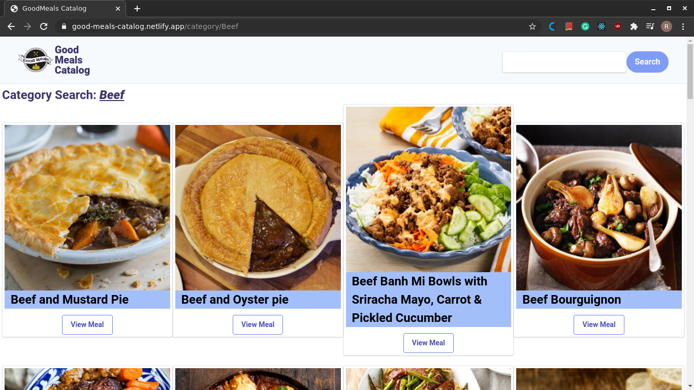
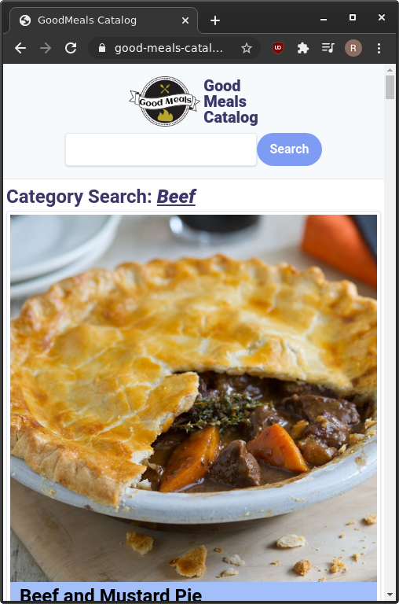

<!-- Badges -->
<p>
  
  <a href="#" target="_blank">
    
  </a>
  <a href="https://twitter.com/redacuve" target="_blank">
    
  </a>
</p>

<!-- Project Header -->
  <p align="center">
    
  <br>
  </p>
  <h1 align="center">Project Meals Catalog</h1>
  <p align="center">
  <br>
   <a href="https://github.com/redacuve/good-meals-catalog"><strong>Explore the repo »</strong></a>
  <br>
    <a href="https://github.com/redacuve/good-meals-catalog/issues">Request Feature</a>
  </p>
  <h2 align="center"><a href="https://good-meals-catalog.netlify.app/"><strong>Live Link!</strong></a></h2>

<!-- TABLE OF CONTENTS -->

## Table of Contents

* [About the Project](#about-the-project)

    * [Screenshot](#screnshoots)

* [Built With](#built-with)

* [Getting Started](#getting-started)

* [How it Works](#how-it-works)

* [Contributing](#contributing)

* [License](#license)

* [Contact](#contact)

<!-- ABOUT THE PROJECT -->

## About The Project

This project is based on the "Catalogue of Dog Clothes", the base idea of this project is taking the inspiration of that project and build my own Catalogue, that is, a browsable list of items that can be filtered and access to the details of every item.

This Catalogue is of meals, It uses the [MealsDB API](https://www.themealdb.com/api.php).

On the Homepage you can see two columns, one is the list of the different categories and the other the list of different areas, you can filter for category or area, a click there and you can see a lot of different meals, also you can search for a specific meal, then you can click to see the Meal preparation.

### Screenshots

#### Desktop

  <p align="center">
    <br>
    <br>
    <br>
    <br>
  </p>

#### Mobile

  <p align="center">
    <br>
    <br>
    <br>
    <br>
  </p>

## Built With

* [React](https://reactjs.org/docs/getting-started.html)

* [Redux](https://redux.js.org/api/api-reference)

* [HTML5](https://developer.mozilla.org/es/docs/HTML/HTML5)

* [CSS](https://developer.mozilla.org/es/docs/Web/CSS)

* Deployed with
    * [netlify](https://docs.netlify.com/)

* npm Packages used:
    * [react](https://www.npmjs.com/package/react)
    * [prop-types](https://www.npmjs.com/package/prop-types)
    * [redux](https://www.npmjs.com/package/redux)
    * [redux-thunk](https://www.npmjs.com/package/redux-thunk)
    * [tailwindcss](https://www.npmjs.com/package/tailwindcss)
    * [eslint](https://www.npmjs.com/package/eslint)
    * [stylelint](https://www.npmjs.com/package/stylelint)
    * [postcss-cli](https://www.npmjs.com/package/postcss-cli)

<!-- GETTING STARTED -->
## Getting Started

To get a local copy up and running follow these simple steps.

Clone or fork the <a href="https://github.com/redacuve/good-meals-catalog">repo</a> [git@github.com:redacuve/good-meals-catalog.git]

*note you need have install npm or yarn
* [npm](https://www.npmjs.com/get-npm)
* [yarn](https://classic.yarnpkg.com/en/docs/install)


<!-- HOW IT WORKS -->
## How it Works

This is a SPA, Every page and the pages for every meal have a unique Route within the SPA.
Built with React & Redux, It retrieves the information from the API and is stored in the Redux Store, also the information from the categories and the areas is filtered.
This application has the source code inside the src folder, the file structure for this project are:
* actions folder: Here are the actions (the payloads of information that send data from the application the store), every file access to a different endpoint of the API.
* assets folder: Here are the assets like the logo and the CSS generated by tailwindcss.
* components folder: Here are all of the stateless components Like errors, loading, or cards.
* containers folder: Here are all of the components that retrieve data from the store and dispatch an action to the store.
* reducers folder: Here are all of the reducers.
* index.js file: Here is where is render the application in the div with id = "root".
* store.js file: Here is located the redux store.
Also, this project is fully responsive for all types of devices, mobile, tablet, desktop, wide-desktop, it uses tailwindCss for that.


## Running the code

*   Navigate to the root directory of the project

*   Run this command on your terminal to install all of the dependecies:
    ```
    $ npm install
    ```

*   Run this command on your terminal to run the code locally on http://localhost:3000:
    ```
    $ npm start
    ```
*   Also you can build this app for production, react are going to make a build folder with minified files, and filenames with hashes for best performance
    ```
    $ npm build
    ```
*   Run this command to Lint the JS files:
    ```
    $ npx eslint .
    ```
*   Run this command to Lint the CSS/SCSS files:
    ```
    $ npx stylelint "**/*.{css,scss}"
    ```
*   You can learn more in the [Create React App Documentation](https://facebook.github.io/create-react-app/docs/getting-started).

* To learn React, check out the [React Documentation](https://reactjs.org/docs/getting-started.html).

* To learn Reduc, check out the [Redux Documentation](https://redux.js.org/introduction/getting-started)

<!-- CONTRIBUTING -->

## Contributing

Contributions are what make the open source community such an amazing place to be learn, inspire, and create. Any contributions you make are **greatly appreciated**.

1. Fork the Project

2. Create your Feature Branch (`git checkout -b feature/AmazingFeature`)

3. Commit your Changes (`git commit -m 'Add some AmazingFeature'`)

4. Push to the Branch (`git push origin feature/AmazingFeature`)

5. Open a Pull Request

<!-- LICENSE -->

## License

This project is under the <a href="https://www.gnu.org/licenses/gpl-3.0.html">GNU Public License V3</a>. For more information see <a href="https://github.com/redacuve/good-meals-catalog/blob/master/LICENSE">here</a>

<!-- CONTACT -->

## Contact

Rey David Cuevas Vela - [@redacuve](https://twitter.com/redacuve) - redacuve@gmail.com -[linkedin.com/in/redacuve/](https://www.linkedin.com/in/redacuve/)

Project Link: [github.com/redacuve/good-meals-catalog](https://github.com/redacuve/good-meals-catalog) - Good Meals Catalog.
